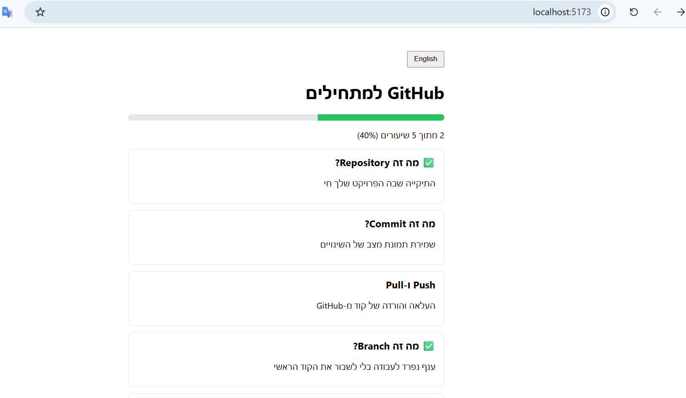

# GitHub למתחילים

מדריך אינטראקטיבי שמלמד את הבסיס של Git ו-GitHub, שיעור אחר שיעור.
הפרויקט בנוי כאפליקציית פול סטאק: פרונטאנד ב-React, API ב-Express ומסד נתונים SQLite.

[English version](README.md)



## יכולות

- רשימת שיעורים: repository, commit, push ו-pull, branch, pull request
- פתיחת שיעור וקריאת ההסבר המלא
- סימון שיעורים כהושלמו
- פס התקדמות שמתעדכן אוטומטית ונשמר במסד הנתונים

## סטאק טכנולוגי

- **פרונטאנד:** React (Vite)
- **בקאנד:** Node.js, Express
- **מסד נתונים:** SQLite (better-sqlite3)

## הרצה מקומית

נדרש Node.js מותקן. מריצים שני טרמינלים במקביל: אחד לשרת ואחד ללקוח.

**1. שכפול הפרויקט**

```bash
git clone https://github.com/Avigailv/github-guide.git
cd github-guide
```

**2. הפעלת השרת (טרמינל 1)**

```bash
cd server
npm install
node index.js
```

ה-API רץ על http://localhost:3000

**3. הפעלת הלקוח (טרמינל 2)**

```bash
cd client
npm install
npm run dev
```

פותחים בדפדפן את http://localhost:5173

## נתיבי ה-API

| Method | Endpoint                    | תיאור                       |
| ------ | --------------------------- | --------------------------- |
| GET    | `/api/lessons`              | רשימת כל השיעורים           |
| GET    | `/api/lessons/:id`          | שיעור בודד                  |
| PATCH  | `/api/lessons/:id/complete` | סימון שיעור כהושלם או לא    |
| GET    | `/api/progress`             | אחוז התקדמות               |

## שדרוגים עתידיים

- חידון בסוף כל שיעור
- הרשמה והתחברות
- פריסה לשרת חי